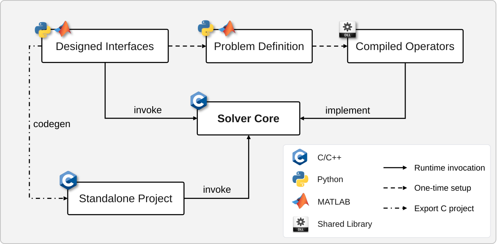
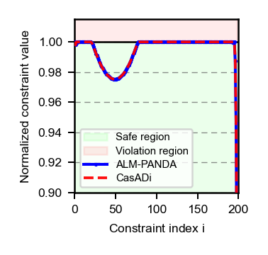
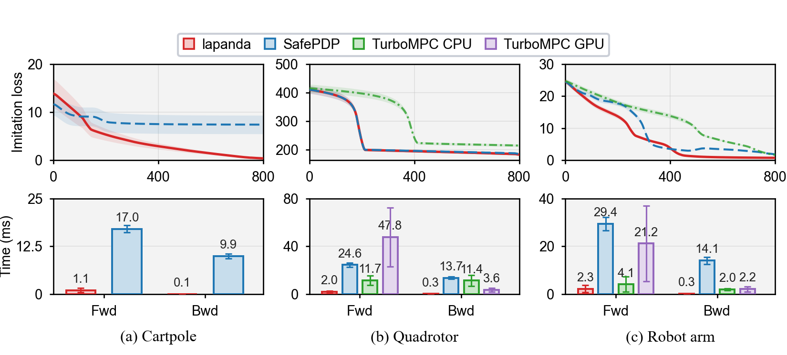
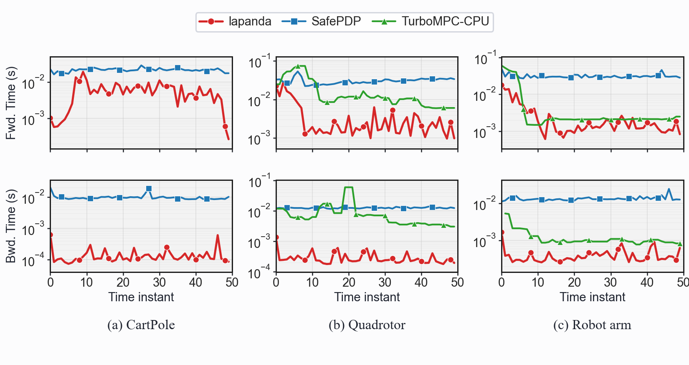
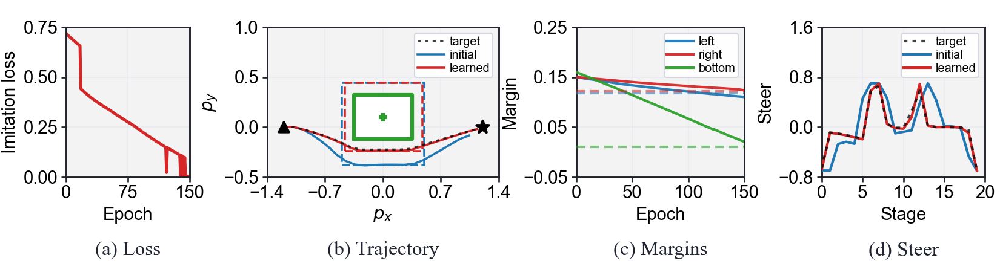

<p align="center">
  
</p>

<h1 align="center">lapanda</h1>

**lapanda** is a differentiable solver framework for constrained nonlinear optimization.  It combines an augmented Lagrangian outer loop with a PANDA projected inner solver, supports CasADi problem descriptions, and exposes Python, MATLAB, and standalone C workflows.

The repository contains the solver runtime, user interfaces, embedded export utilities, and the paper experiments. The Python distribution and import name are both `lapanda`.

<p align="center">
  
</p>

<p align="center"><em>Software architecture and multi-platform workflow.</em></p>

## Project Summary

lapanda targets problems of the form

```text
minimize_u   f(u, theta)
subject to   u in U
             c_lower <= c(u, theta, variable) <= c_upper
```

with an optional outer loss `L(u*, theta, variable)` for differentiating through the solution.  Simple variable bounds are handled through a projection operator, while general nonlinear constraints are handled by the augmented Lagrangian layer.  The backward pass returns the gradient of the outer loss with respect to the learnable parameters.

The current implementation provides:

- C implementations of PANDA and the augmented Lagrangian outer solver.
- Python bindings through pybind11.
- CasADi-based Python and MATLAB problem construction.
- A compiled backend that generates CasADi C oracles and loads them from the
  Python solver.
- Standalone C export for embedded or ROS-style deployment.
- Paper experiments for nonconvex Rosenbrock constraints, constrained OCP
  imitation learning, and embedded obstacle avoidance.

## File Structure

```text
alm/                         augmented Lagrangian solver core
panda/                       PANDA solver core
include/                     public C headers
adapters/casadi_static/      static adapter for exported CasADi C oracles
python/lapanda/              public Python user API
python/src/                  pybind11 C++ bindings
matlab/                      MATLAB CasADi-to-MEX interface
exports/                     exported embedded/ROS projects used by experiments
experiments/
  panda_box_rosenbrock/      legacy unnumbered box-Rosenbrock checks
  exp1_rosenbrock_smooth_constraints/  paper Exp.1 nonconvex constrained Rosenbrock
  exp2_OCPs/                 paper Exp.2 constrained OCP imitation learning
  exp3_embedded_export/      paper Exp.3 embedded obstacle avoidance
tutorials/                   Python notebook, MATLAB, and C usage examples
docs/                        documentation assets
```

## Installation

lapanda's default solver path uses generated CasADi C oracles and native C code.  Installing the solver and using the full compiled backend therefore requires both CMake and a working C/C++ compiler.

Please make sure the following commands are available from your terminal:

```powershell
cmake --version
```

On Linux/macOS, also check:

```bash
cc --version
```

On Windows, use one of the following compiler setups:

- Visual Studio Build Tools with the C++ workload.
- MinGW-w64, with `mingw32-make` and the compiler `bin` directory added to
  `PATH`.

If CMake is missing:

1. Install CMake from <https://cmake.org/download/>.
2. During installation, enable the option that adds CMake to `PATH`.
3. Restart the terminal and run `cmake --version`.

If a compiler is missing on Windows:

1. Install Visual Studio Build Tools, or install MinGW-w64.
2. Add the compiler `bin` directory to the system `PATH`.
3. Restart the terminal and verify that `gcc --version` or the Visual Studio
   compiler tools are visible.

### Python Interface

Requirements:

- Python 3.8 or newer.
- Python packages: `casadi`, `numpy`, `pybind11`, `scikit-build-core`.
- For the notebook tutorial: `jupyter`, `matplotlib`.

From the repository root:

```powershell
git clone git@github.com:optiXlab1/lapanda.git
cd <path-to>/lapanda

python -m pip install -e .
```

Verify:

```powershell
python -c "import lapanda; import lapanda._lapanda as m; print(lapanda.__file__); print(m.__name__)"
python -m pip show lapanda
```

Expected import name:

```python
import lapanda
```

The default Python backend is `compiled`, which generates a CasADi C oracle under `.lapanda_cache` and builds it with CMake. Use `backend="callback"` for small debugging problems when you do not want code generation.

### MATLAB Interface

Requirements:

- MATLAB with MEX support.
- CasADi for MATLAB on the MATLAB path.
- CMake and a compiler supported by MATLAB MEX.

Add the lapanda MATLAB interface and CasADi to the path:

```matlab
repo = '<path-to>/lapanda';
addpath(fullfile(repo, 'matlab'));
addpath(genpath(fullfile(repo, 'matlab', 'casadi-3.7.2-windows64-matlab2018b')));
```

Then construct a `problem` struct and call:

```matlab
solver = lapanda_create_solver(problem, fullfile(tempdir, 'lapanda_demo'));
result = solver.solve_alm(x0, theta, variable, constraint_lower, constraint_upper, options);
```

See `tutorials/matlab_minimal.m` for a complete minimal example.

## Usage Examples

Minimal examples are kept in `tutorials/`:

```text
tutorials/python_learning.ipynb   Python parameter-learning tutorial
tutorials/matlab_minimal.m        MATLAB CasADi/MEX workflow
tutorials/c_export_minimal.md     standalone C export and build workflow
```

Run the Python tutorial notebook:

```powershell
jupyter notebook tutorials\python_learning.ipynb
```

The notebook builds a small nonlinear constrained problem, differentiates an outer loss through the lapanda solution, and learns the parameter vector `theta` to match a demonstration.

## Experiment Reproduction

The paper experiments and their retained results are organized under `experiments/`. Each experiment README gives the corresponding reproduction procedure. Running an experiment may overwrite files in its `results/` directory.

### Paper-to-code map

Here `exp1/`, `exp2/`, and `exp3/` denote the three experiment directories
under `experiments/`; the links below point to their actual locations.

| Paper item &nbsp;&nbsp; | Script or source | Result file |
| --- | --- | --- |
| Table 2 | [`exp1/run_matched_accuracy_timing.py`](experiments/exp1_rosenbrock_smooth_constraints/run_matched_accuracy_timing.py)<br>[`exp1/run_matched_accuracy_casadi.py`](experiments/exp1_rosenbrock_smooth_constraints/run_matched_accuracy_casadi.py)<br>[`exp1/run_matched_accuracy_memory.py`](experiments/exp1_rosenbrock_smooth_constraints/run_matched_accuracy_memory.py)<br>[`exp1/run_matched_accuracy_summary.py`](experiments/exp1_rosenbrock_smooth_constraints/run_matched_accuracy_summary.py) | [`summary.csv`](experiments/exp1_rosenbrock_smooth_constraints/matched_accuracy/summary.csv) |
| Fig. 2 | [`exp1/run_constraint_activity.py`](experiments/exp1_rosenbrock_smooth_constraints/run_constraint_activity.py) | [`exp1_constraint_activity.pdf`](experiments/exp1_rosenbrock_smooth_constraints/results/exp1_constraint_activity.pdf) |
| Table 5 | command-line settings in [`exp1/README.md`](experiments/exp1_rosenbrock_smooth_constraints/README.md) | generated `config.json` files |
| Table 6 | [`exp1/run_penalty_gradient_sweep.py`](experiments/exp1_rosenbrock_smooth_constraints/run_penalty_gradient_sweep.py) | [`exp1_penalty_gradient_sweep.csv`](experiments/exp1_rosenbrock_smooth_constraints/results/exp1_penalty_gradient_sweep.csv) |
| Table 7 | [`exp1/run_matched_accuracy_timing.py`](experiments/exp1_rosenbrock_smooth_constraints/run_matched_accuracy_timing.py) with `--methods lapanda_base` | [`balanced/summary.csv`](experiments/exp1_rosenbrock_smooth_constraints/matched_accuracy/balanced/summary.csv) |
| Table 8 | [`exp1/post_forward_refinement/run_comparison.py`](experiments/exp1_rosenbrock_smooth_constraints/post_forward_refinement/run_comparison.py) | [`post_forward_refinement.csv`](experiments/exp1_rosenbrock_smooth_constraints/post_forward_refinement/results/post_forward_refinement.csv) |
| Table 9 | the four `exp1/run_matched_accuracy_*.py` scripts listed for Table 2 | [`summary.csv`](experiments/exp1_rosenbrock_smooth_constraints/matched_accuracy/summary.csv) |
| Fig. 3 | [`exp2/run_open_loop.py`](experiments/exp2_OCPs/run_open_loop.py), then [`exp2/plot_open_loop.py`](experiments/exp2_OCPs/plot_open_loop.py) | [`ocp_fixed32_2x3_loss_timing.pdf`](experiments/exp2_OCPs/summary_results/ocp_fixed32_2x3_loss_timing.pdf) |
| Fig. 4 | [`exp2/run_closed_loop.py`](experiments/exp2_OCPs/run_closed_loop.py), then [`exp2/plot_closed_loop.py`](experiments/exp2_OCPs/plot_closed_loop.py) | [`paper_ocp_1x6_loss_constraints.pdf`](experiments/exp2_OCPs/summary_results/paper_ocp_1x6_loss_constraints.pdf) |
| Table 3 | [`exp2/run_closed_loop.py`](experiments/exp2_OCPs/run_closed_loop.py), then [`exp2/plot_closed_loop.py`](experiments/exp2_OCPs/plot_closed_loop.py) | [`paper_safepdp_vs_alm_table.csv`](experiments/exp2_OCPs/summary_results/paper_safepdp_vs_alm_table.csv) |
| Tables 10 and 11 | [`exp2/config.py`](experiments/exp2_OCPs/config.py) and the configuration saved with each run | JSON files beside the OCP results |
| Fig. 7 | [`exp2/plot_closed_loop.py`](experiments/exp2_OCPs/plot_closed_loop.py) | [`paper_safepdp_loss_comparison.pdf`](experiments/exp2_OCPs/summary_results/paper_safepdp_loss_comparison.pdf) |
| Table 12 | [`exp2/run_gradient_checkpoint_diagnostics.py`](experiments/exp2_OCPs/run_gradient_checkpoint_diagnostics.py) | [`ocp_gradient_checkpoint_summary.csv`](experiments/exp2_OCPs/summary_results/ocp_gradient_checkpoint_summary.csv) |
| Fig. 8 | [`exp2/plot_closed_loop.py`](experiments/exp2_OCPs/plot_closed_loop.py) | [`paper_safepdp_timing_comparison.pdf`](experiments/exp2_OCPs/summary_results/paper_safepdp_timing_comparison.pdf) |
| Fig. 9 | [`exp2/run_nonlinear_horizon_scaling.py`](experiments/exp2_OCPs/run_nonlinear_horizon_scaling.py)<br>[`exp2/plot_horizon_scaling.py`](experiments/exp2_OCPs/plot_horizon_scaling.py) | [`nonlinear_horizon_scaling_gpu.pdf`](experiments/exp2_OCPs/summary_results/nonlinear_horizon_scaling_lapanda_turbompc_gpu.pdf) |
| Table 4 | bundles generated by [`exp3/circle/export_circle_ros_project.py`](experiments/exp3_embedded_export/circle/export_circle_ros_project.py), [`exp3/rectangle/export_rectangle_ros_project.py`](experiments/exp3_embedded_export/rectangle/export_rectangle_ros_project.py), and [`exp3/export_acados_bundles.py`](experiments/exp3_embedded_export/export_acados_bundles.py), then benchmarked under [`exports/`](exports/) | [`summary.csv`](experiments/exp3_embedded_export/results/summary.csv) |
| Fig. 6 | [`exp3/rectangle/plot_summary.py`](experiments/exp3_embedded_export/rectangle/plot_summary.py) | [`rectangle_imitation_1x4.pdf`](experiments/exp3_embedded_export/results/rectangle/lapanda/figures/rectangle_imitation_1x4.pdf) |
| Fig. 10 | [`exp3/circle/plot_summary.py`](experiments/exp3_embedded_export/circle/plot_summary.py) | [`circle_obstacle_solution.pdf`](experiments/exp3_embedded_export/results/circle/figures/circle_obstacle_solution.pdf) |
| Table 13 | [`exp3/config.py`](experiments/exp3_embedded_export/config.py) and exported solver configurations | configuration files in [`exports/`](exports/) |
| Fig. 11 | [`exp3/rectangle/run_smoothed_mpcc_lapanda_rollout.py`](experiments/exp3_embedded_export/rectangle/run_smoothed_mpcc_lapanda_rollout.py), [`exp3/rectangle/run_smoothed_mpcc_acados_rollout.py`](experiments/exp3_embedded_export/rectangle/run_smoothed_mpcc_acados_rollout.py), then [`exp3/rectangle/plot_smoothed_mpcc_appendix.py`](experiments/exp3_embedded_export/rectangle/plot_smoothed_mpcc_appendix.py) | [`smoothed_mpcc_step_time.pdf`](experiments/exp3_embedded_export/results/rectangle/comparison/smoothed_mpcc_rollout_and_step_time.pdf) |

Table 1 is the related-work comparison and is maintained directly in the paper. Figs. 1 and 5 are the method overview and platform photograph rather than generated experimental results. Fig. 12 is the [software diagram](docs/assets/lapanda_software.svg).

For exact arguments and run order, see the READMEs for [Exp. 1](experiments/exp1_rosenbrock_smooth_constraints/README.md), [Exp. 2](experiments/exp2_OCPs/README.md), and [Exp. 3](experiments/exp3_embedded_export/README.md).

### Exp.1: Rosenbrock With Smooth General Constraints

The paper's matched-accuracy timing, Explicit-KKT ablation, memory benchmark, constraint-activity figure, and appendix diagnostics each have a descriptive `run_*.py` entry point. The exact commands and their output files are mapped in `experiments/exp1_rosenbrock_smooth_constraints/README.md`; retained Table 2 records are under `matched_accuracy/`.

Constraint activity figure:

```powershell
python experiments\exp1_rosenbrock_smooth_constraints\run_constraint_activity.py
```

Representative output:



### Exp.2: Constrained OCP Imitation Learning

The SafePDP baseline uses a patched upstream checkout. Prepare it once before running the baseline experiments:

```powershell
git clone https://github.com/wanxinjin/Safe-PDP.git external\Safe-PDP
git -C external\Safe-PDP apply ..\safepdp-lapanda.patch
```

Closed-loop imitation:

```powershell
python experiments\exp2_OCPs\run_closed_loop.py
python experiments\exp2_OCPs\plot_closed_loop.py
```

Open-loop imitation:

```powershell
python experiments\exp2_OCPs\run_open_loop.py
python experiments\exp2_OCPs\plot_open_loop.py
```

First MPC rollout timing:

```powershell
python experiments\exp2_OCPs\plot_first_mpc_timing.py
```

Nonlinear Quadrotor horizon scaling (lapanda measurements and figure):

```powershell
python experiments\exp2_OCPs\run_nonlinear_horizon_scaling.py
python experiments\exp2_OCPs\plot_horizon_scaling.py
```

The retained scaling CSV also contains the TurboMPC-GPU measurements collected in its separate runtime environment.

The paper SafePDP baseline uses COC mode.  TurboMPC data are read from the existing `turbompc/results` files for Quadrotor and Robot Arm; CartPole omits TurboMPC.

Representative outputs:





### Exp.3: LIMO Vehicle Experiments

Exp.3 is performed on an AgileX LIMO vehicle running ROS1. Generate the standalone C and ROS deployment bundle on the host machine:

```powershell
python experiments\exp3_embedded_export\circle\export_circle_ros_project.py --force
python experiments\exp3_embedded_export\rectangle\export_rectangle_ros_project.py --force
python experiments\exp3_embedded_export\export_acados_bundles.py --force
```

Copy the resulting `exports/` directory to the LIMO computer. Solver timing and memory are measured with the standalone executables on that platform; the ROS1 nodes are used for the physical circle and rectangle obstacle-avoidance experiments. The device-side validation, build, benchmark, and ROS commands are given in `exports/README.md`.

The measurements reported in Table 4 are retained in `experiments/exp3_embedded_export/results/summary.csv`. The complete Exp.3 procedure and recorded solver settings are described in `experiments/exp3_embedded_export/README.md`.

Representative output:



## Solver Parameters

### Problem Description

Python and MATLAB users describe a problem with these symbolic fields:

| Field | Meaning | Required |
| --- | --- | --- |
| `u` | decision vector | yes |
| `theta` | learnable/runtime parameter vector | yes |
| `variable` | extra runtime data, such as initial state or target | yes, can be empty |
| `cost` | smooth inner objective `f(u, theta, variable)` | yes |
| `box_lower`, `box_upper` | simple bounds defining the projection set `U` | optional |
| `constraints` | general nonlinear constraints `c(u, theta, variable)` | required for lapanda/ALM |
| `outer_loss` | scalar loss differentiated through the solution | required for backward computation |

### `build_solver`

```python
solver = lapanda.build_solver(
    problem,
    backend="compiled",
    name="lapanda_oracle",
    cache_dir=None,
    force=False,
    cmake_generator=None,
)
```

| Argument | Meaning |
| --- | --- |
| `backend` | `"compiled"` generates and builds a CasADi C oracle; `"callback"` uses Python callbacks for debugging |
| `name` | generated oracle/library name for the compiled backend |
| `cache_dir` | directory for generated C code and build files; default is `.lapanda_cache` |
| `force` | regenerate and rebuild even when a cached oracle exists |
| `cmake_generator` | optional CMake generator string, e.g. `"Ninja"` or a Visual Studio generator |

### `SolverOptions`

These options control PANDA inner iterations.

| Option | Meaning | Typical value |
| --- | --- | --- |
| `max_iterations` | maximum PANDA iterations | `1000`-`4000` |
| `tolerance` | residual tolerance for the projected fixed-point residual | `1e-3` to `1e-6` |
| `buffer_size` | L-BFGS correction history size | `10` |
| `max_stable_iter` | number of stable PANDA iterations used before checking whether the step size can be increased; set `0` to disable this check | `80`-`120` |
| `verbose` | kept for API compatibility; CSV tracing is disabled | `0` |

### `AlmOptions`

These options control the augmented Lagrangian outer loop.

| Option | Meaning | Typical value |
| --- | --- | --- |
| `max_iterations` | maximum ALM outer iterations | `20` or `100` |
| `tolerance` | ALM residual/constraint tolerance | `1e-3` to `1e-6` |
| `initial_penalty` | initial penalty `rho_0` | problem dependent |
| `penalty_update_factor` | multiplier for penalty updates | `5` or `10` |
| `max_penalty` | penalty cap; `0.0` means uncapped | `0.0` or `1e8` |
| `sufficient_decrease_factor` | residual decrease test parameter | `0.25` |
| `warm_start_inner` | reuse current solution when moving between ALM subproblems | `True` |
| `verbose` | kept for API compatibility | `0` |

### `BackwardOptions`

These options control the residual-based backward solve.

| Option | Meaning | Typical value |
| --- | --- | --- |
| `enable` | compute `dL/dtheta` when `True` | `True` |
| `tolerance` | backward linear-solver tolerance | same as forward tolerance |
| `max_iterations` | maximum backward iterations | `200`-`800` |
| `linear_solver` | Krylov method: `cg`, `minres`, `gmres`, or `auto`; CG falls back to MINRES on failure | `cg` |
| `restart` | restarted-GMRES subspace dimension; ignored by CG/MINRES | `40` |
| `constraint_penalty_scale` | scale applied to the final ALM penalty only in backward constraint callbacks | `1` or `10` |
| `constraint_penalty_max` | cap for the scaled backward penalty; `0.0` means uncapped | `0.0` or `1e6` |

### Solve Calls

Plain PANDA for box/simple projected problems:

```python
result = solver.solve_panda(
    x0, theta, variable,
    solver_options=inner_options,
    backward_options=backward_options,
)
```

lapanda for general nonlinear constraints:

```python
result = solver.solve_lapanda(
    x0, theta, variable,
    constraint_lower, constraint_upper,
    inner_solver_options=inner_options,
    alm_options=alm_options,
    backward_options=backward_options,
    multiplier0=None,
    penalty0=None,
    adjoint0=None,
)
```

Here `multiplier0` and `penalty0` are optional ALM warm starts. When provided, both should be vectors with the same length as the general constraint vector.

Important result fields include `solution`, `grad_theta`, `multipliers`,`penalties`, `forward_time_sec`, `backward_time_sec`, `iterations`,`inner_iterations`, `final_residual`, `backward_iterations`, and `backward_residual`. Backward-enabled calls additionally report `backward_solver_used`, `backward_fallback_used`, and `backward_peak_workspace_bytes`.
