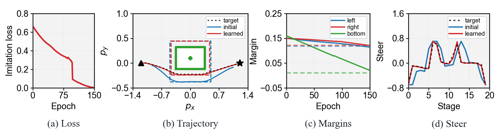

<p align="center">
  
</p>

<h1 align="center">lapanda</h1>

**lapanda** is a differentiable solver framework for constrained nonlinear
optimization.  It combines an augmented Lagrangian outer loop with a PANDA
projected inner solver, supports CasADi problem descriptions, and exposes
Python, MATLAB, and standalone C workflows.

The repository contains the solver runtime, user interfaces, embedded export
utilities, and the paper experiments. The Python distribution and import name
are both `lapanda`.

<p align="center">
  
</p>

<p align="center"><em>Software architecture and multi-platform workflow.</em></p>

## Project Summary

lapanda targets problems of the form

```text
minimize_u   f(u, theta)
subject to   u in U
             c_lower <= c(u, theta, variable) <= c_upper
```

with an optional outer loss `L(u*, theta, variable)` for differentiating
through the solution.  Simple variable bounds are handled through a projection
operator, while general nonlinear constraints are handled by the augmented
Lagrangian layer.  The backward pass returns the gradient of the outer loss
with respect to the learnable parameters.

The current implementation provides:

- C implementations of PANDA and the augmented Lagrangian outer solver.
- Python bindings through pybind11.
- CasADi-based Python and MATLAB problem construction.
- A compiled backend that generates CasADi C oracles and loads them from the
  Python solver.
- Standalone C export for embedded or ROS-style deployment.
- Paper experiments for nonconvex Rosenbrock constraints, constrained OCP
  imitation learning, and embedded obstacle avoidance.

## File Structure

```text
alm/                         augmented Lagrangian solver core
panda/                       PANDA projected solver core
include/                     public C headers
adapters/casadi_static/      static adapter for exported CasADi C oracles
python/lapanda/              public Python user API
python/src/                  pybind11 C++ bindings
matlab/                      MATLAB CasADi-to-MEX interface
exports/                     exported embedded/ROS projects used by experiments
experiments/
  panda_box_rosenbrock/      legacy unnumbered box-Rosenbrock checks
  exp1_rosenbrock/           paper Exp.1 nonconvex constrained Rosenbrock
  exp2_OCPs/                 paper Exp.2 constrained OCP imitation learning
  exp3_embedded_export/      paper Exp.3 embedded obstacle avoidance
tutorials/                   Python notebook, MATLAB, and C usage examples
docs/                        documentation assets
```

## Installation

lapanda's default solver path uses generated CasADi C oracles and native C
code.  Installing the solver and using the full compiled backend therefore
requires both CMake and a working C/C++ compiler.

Please make sure the following commands are available from your terminal:

```powershell
cmake --version
```

On Linux/macOS, also check:

```bash
cc --version
```

On Windows, use one of the following compiler setups:

- Visual Studio Build Tools with the C++ workload.
- MinGW-w64, with `mingw32-make` and the compiler `bin` directory added to
  `PATH`.

If CMake is missing:

1. Install CMake from <https://cmake.org/download/>.
2. During installation, enable the option that adds CMake to `PATH`.
3. Restart the terminal and run `cmake --version`.

If a compiler is missing on Windows:

1. Install Visual Studio Build Tools, or install MinGW-w64.
2. Add the compiler `bin` directory to the system `PATH`.
3. Restart the terminal and verify that `gcc --version` or the Visual Studio
   compiler tools are visible.

### Python Interface

Requirements:

- Python 3.8 or newer.
- Python packages: `casadi`, `numpy`, `pybind11`, `scikit-build-core`.
- For the notebook tutorial: `jupyter`, `matplotlib`.

From the repository root:

```powershell
git clone git@github.com:optiXlab1/lapanda.git
cd <path-to>/lapanda

python -m pip install -e .
```

Verify:

```powershell
python -c "import lapanda; import lapanda._lapanda as m; print(lapanda.__file__); print(m.__name__)"
python -m pip show lapanda
```

Expected import name:

```python
import lapanda
```

The default Python backend is `compiled`, which generates a CasADi C oracle
under `.lapanda_cache` and builds it with CMake. Use `backend="callback"` for
small debugging problems when you do not want code generation.

### MATLAB Interface

Requirements:

- MATLAB with MEX support.
- CasADi for MATLAB on the MATLAB path.
- CMake and a compiler supported by MATLAB MEX.

Add the lapanda MATLAB interface and CasADi to the path:

```matlab
repo = '<path-to>/lapanda';
addpath(fullfile(repo, 'matlab'));
addpath(genpath(fullfile(repo, 'matlab', 'casadi-3.7.2-windows64-matlab2018b')));
```

Then construct a `problem` struct and call:

```matlab
solver = lapanda_create_solver(problem, fullfile(tempdir, 'lapanda_demo'));
result = solver.solve_alm(x0, theta, variable, constraint_lower, constraint_upper, options);
```

See `tutorials/matlab_minimal.m` for a complete minimal example.

## Usage Examples

Minimal examples are kept in `tutorials/`:

```text
tutorials/python_learning.ipynb   Python parameter-learning tutorial
tutorials/matlab_minimal.m        MATLAB CasADi/MEX workflow
tutorials/c_export_minimal.md     standalone C export and build workflow
```

Run the Python tutorial notebook:

```powershell
jupyter notebook tutorials\python_learning.ipynb
```

The notebook builds a small nonlinear constrained problem, differentiates an
outer loss through the lapanda solution, and learns the parameter vector
`theta` to match a demonstration.

## Experiment Reproduction

The paper experiments are organized so that each group has a direct run script
and a direct plotting script.  Running the full experiments may overwrite the
CSV files in each `results/` directory.  To preserve existing paper results,
copy the corresponding `results/` directory before rerunning an experiment.

### Exp.1: Rosenbrock With Smooth General Constraints

Main timing and gradient comparison:

```powershell
python experiments\exp1_rosenbrock_smooth_constraints\run_scaling_study.py
```

Memory measurements:

```powershell
python experiments\exp1_rosenbrock_smooth_constraints\run_memory_lapanda.py
python experiments\exp1_rosenbrock_smooth_constraints\run_memory_casadi.py
```

Constraint activity figure:

```powershell
python experiments\exp1_rosenbrock_smooth_constraints\plot_constraint_activity.py
```

The scaling script writes `exp1_scaling_raw.csv`,
`exp1_scaling_summary.csv`, and `exp1_constraint_sample.npz`.

Representative output:


### Exp.2: Constrained OCP Imitation Learning

The SafePDP baseline uses a patched upstream checkout. Prepare it once before
running the baseline experiments:

```powershell
git clone https://github.com/wanxinjin/Safe-PDP.git external\Safe-PDP
git -C external\Safe-PDP apply ..\safepdp-lapanda.patch
```

Closed-loop imitation:

```powershell
python experiments\exp2_OCPs\run_closed_loop.py
python experiments\exp2_OCPs\plot_closed_loop.py
```

Open-loop imitation:

```powershell
python experiments\exp2_OCPs\run_open_loop.py
python experiments\exp2_OCPs\plot_open_loop.py
```

First MPC rollout timing:

```powershell
python experiments\exp2_OCPs\plot_first_mpc_timing.py
```

Nonlinear Quadrotor horizon scaling (lapanda measurements and figure):

```powershell
python experiments\exp2_OCPs\run_nonlinear_horizon_scaling.py
python experiments\exp2_OCPs\plot_horizon_scaling.py
```

The retained scaling CSV also contains the TurboMPC-GPU measurements collected
in its separate runtime environment.

The paper SafePDP baseline uses COC mode.  TurboMPC data are read from the
existing `turbompc/results` files for Quadrotor and Robot Arm; CartPole omits
TurboMPC.

Representative outputs:


### Exp.3: Embedded Obstacle Avoidance

Circle task:

```powershell
python experiments\exp3_embedded_export\circle\run_lapanda.py --compute-backward
python experiments\exp3_embedded_export\circle\acados.py
python experiments\exp3_embedded_export\circle\plot_summary.py
```

Rectangle task:

```powershell
python experiments\exp3_embedded_export\rectangle\run_lapanda.py
python experiments\exp3_embedded_export\rectangle\acados.py --backend acados
python experiments\exp3_embedded_export\rectangle\plot_summary.py
```

Smoothed rectangular-obstacle rollout used by the appendix:

```powershell
python experiments\exp3_embedded_export\rectangle\run_smoothed_mpcc_lapanda_rollout.py
python experiments\exp3_embedded_export\rectangle\run_smoothed_mpcc_acados_rollout.py
python experiments\exp3_embedded_export\rectangle\plot_smoothed_mpcc_appendix.py
```

The rectangle paper figure defaults to the exported C result directory:

```text
experiments/exp3_embedded_export/results/rectangle/c_export_wider_sides_e150
```

The plotting script reconstructs the displayed trajectories from the recorded
export results.

Representative output:



## Solver Parameters

### Problem Description

Python and MATLAB users describe a problem with these symbolic fields:

| Field | Meaning | Required |
| --- | --- | --- |
| `u` | decision vector | yes |
| `theta` | learnable/runtime parameter vector | yes |
| `variable` | extra runtime data, such as initial state or target | yes, can be empty |
| `cost` | smooth inner objective `f(u, theta, variable)` | yes |
| `box_lower`, `box_upper` | simple bounds defining the projection set `U` | optional |
| `constraints` | general nonlinear constraints `c(u, theta, variable)` | optional for PANDA, required for ALM constraints |
| `outer_loss` | scalar loss differentiated through the solution | optional for forward-only solves |

### `build_solver`

```python
solver = lapanda.build_solver(
    problem,
    backend="compiled",
    name="lapanda_oracle",
    cache_dir=None,
    force=False,
    cmake_generator=None,
)
```

| Argument | Meaning |
| --- | --- |
| `backend` | `"compiled"` generates and builds a CasADi C oracle; `"callback"` uses Python callbacks for debugging |
| `name` | generated oracle/library name for the compiled backend |
| `cache_dir` | directory for generated C code and build files; default is `.lapanda_cache` |
| `force` | regenerate and rebuild even when a cached oracle exists |
| `cmake_generator` | optional CMake generator string, e.g. `"Ninja"` or a Visual Studio generator |

### `SolverOptions`

These options control PANDA inner iterations.

| Option | Meaning | Typical value |
| --- | --- | --- |
| `max_iterations` | maximum PANDA iterations | `1000`-`4000` |
| `tolerance` | residual tolerance for the projected fixed-point residual | `1e-3` to `1e-6` |
| `buffer_size` | L-BFGS correction history size | `10` |
| `max_stable_iter` | number of stable PANDA iterations used before checking whether the step size can be increased; set `0` to disable this check | `80`-`120` |
| `verbose` | kept for API compatibility; CSV tracing is disabled | `0` |

### `AlmOptions`

These options control the augmented Lagrangian outer loop.

| Option | Meaning | Typical value |
| --- | --- | --- |
| `max_iterations` | maximum ALM outer iterations | `20` or `100` |
| `tolerance` | ALM residual/constraint tolerance | `1e-3` to `1e-6` |
| `initial_penalty` | initial penalty `rho_0` | problem dependent |
| `penalty_update_factor` | multiplier for penalty updates | `5` or `10` |
| `max_penalty` | penalty cap; `0.0` means uncapped | `0.0` or `1e8` |
| `sufficient_decrease_factor` | residual decrease test parameter | `0.25` |
| `warm_start_inner` | reuse current solution when moving between ALM subproblems | `True` |
| `verbose` | kept for API compatibility | `0` |

### `BackwardOptions`

These options control the residual-based backward solve.

| Option | Meaning | Typical value |
| --- | --- | --- |
| `enable` | compute `dL/dtheta` when `True` | `True` |
| `tolerance` | backward linear-solver tolerance | same as forward tolerance |
| `max_iterations` | maximum backward iterations | `200`-`800` |
| `constraint_penalty_scale` | scale applied to the final ALM penalty only in backward constraint callbacks | `1` or `10` |
| `constraint_penalty_max` | cap for the scaled backward penalty; `0.0` means uncapped | `0.0` or `1e6` |

### Solve Calls

Plain PANDA for box/simple projected problems:

```python
result = solver.solve_panda(
    x0, theta, variable,
    solver_options=inner_options,
    backward_options=backward_options,
)
```

lapanda for general nonlinear constraints:

```python
result = solver.solve_lapanda(
    x0, theta, variable,
    constraint_lower, constraint_upper,
    inner_solver_options=inner_options,
    alm_options=alm_options,
    backward_options=backward_options,
    multiplier0=None,
    penalty0=None,
    adjoint0=None,
)
```

Here `multiplier0` and `penalty0` are optional ALM warm starts. When provided,
both should be vectors with the same length as the general constraint vector.

Important result fields include `solution`, `grad_theta`, `multipliers`,
`penalties`, `forward_time_sec`, `backward_time_sec`, `iterations`,
`inner_iterations`, `final_residual`, `backward_iterations`, and
`backward_residual`.
